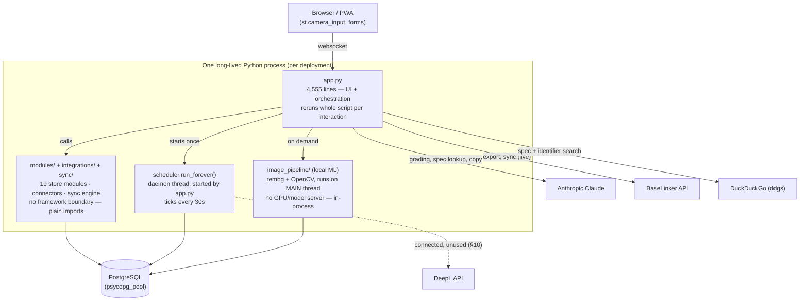
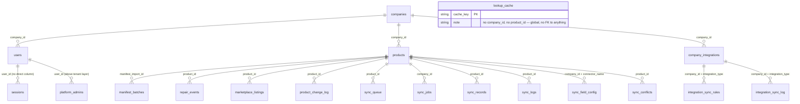
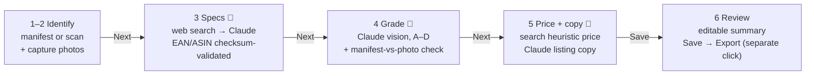
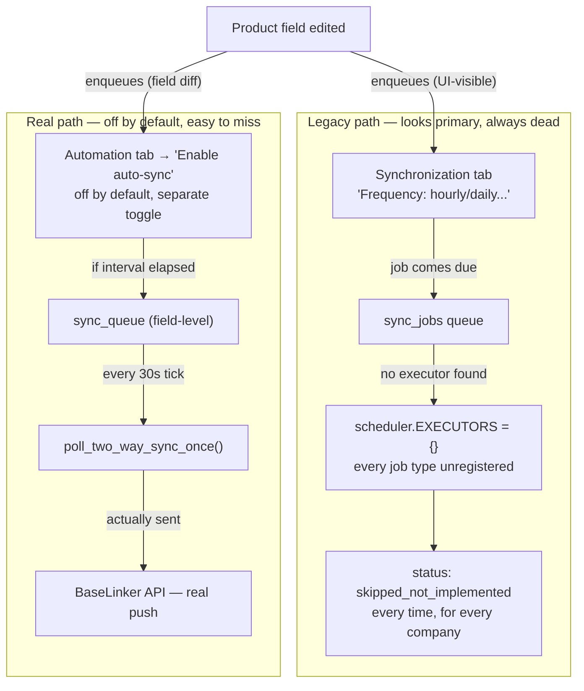

# ElectroGrader — Complete Technical Audit

*A complete technical accounting of the codebase as it exists today — architecture, schema, workflows, integrations, AI modules, security posture, performance, debt, and what's actually missing before this can call itself a production SaaS. Written to be read by the person who has to maintain it.*

**Scope:** full repository, 19 store modules, 4 AI modules, 1 live marketplace connector
**Stack:** Streamlit · PostgreSQL · Anthropic Claude
**Stance:** brutally honest, nothing summarized away

---

## Table of contents

1. [Project overview](#1-project-overview)
2. [Architecture](#2-architecture)
3. [Folder structure](#3-folder-structure)
4. [Database](#4-database)
5. [User management](#5-user-management)
6. [Inventory workflow](#6-inventory-workflow)
7. [Marketplace integrations](#7-marketplace-integrations)
8. [Export system](#8-export-system)
9. [Synchronization engine](#9-synchronization-engine)
10. [AI modules](#10-ai-modules)
11. [Security audit](#11-security-audit)
12. [Performance audit](#12-performance-audit)
13. [Technical debt](#13-technical-debt)
14. [Missing features](#14-missing-features)
15. [Top 20 weaknesses](#15-top-20-weaknesses)
16. [Development roadmap](#16-development-roadmap)

---

## 1. Project overview

ElectroGrader is a mobile-first inventory pipeline for a used/liquidated-electronics reseller: it takes a pallet of unknown, unsorted devices and turns each one into a graded, described, priced, marketplace-ready listing — with AI doing the parts a human shouldn't have to (specs, condition, copy) and a human confirming every decision before it ships.

### What it actually does

A warehouse worker photographs an item, and across a six-step wizard the app: identifies it (EAN/ASIN lookup, web search), pulls its specifications (web search + Claude), grades its cosmetic condition from the photos (Claude vision), estimates a resale price (web search heuristics), and writes marketplace-ready title/description copy (Claude) — all editable, all requiring an explicit human "Next" before anything is saved, and a further explicit "Export" before anything reaches a marketplace. The result lands in a searchable inventory, exportable as CSV/Excel or pushed live to BaseLinker (the one fully-wired marketplace connector).

### The problem it solves

Liquidation manifests are unreliable by construction — the claimed contents, condition, and even identity of a pallet item are frequently wrong, and grading 500 unknown devices by hand (look up the model, write the listing, judge the condition, price it) is the actual bottleneck in this business, not photography or logistics. ElectroGrader's core bet is that AI can do the first draft of every one of those judgment calls fast enough to make bulk resale economical, as long as a human never has to trust it blindly — hence the manifest-vs-photo mismatch detector, the barcode-checksum validation independent of what the AI reports, and the fact that literally nothing in the wizard auto-saves without a click.

### Current development stage

This is a working, single-team internal tool that has been extended incrementally, feature by feature, without a formal phase gate — the codebase's own comments describe its integration/sync layer explicitly in terms of "Phase 1," "Phase 2," "Phase 3.2," "Phase 3.3" of a "Universal Integration Architecture," and that phasing is visible everywhere: a large amount of genuinely well-built infrastructure (a job queue, a conflict resolver, a common export model, a second marketplace's OAuth-readiness) exists in the codebase and is exercised only by its own verification scripts, not by the running app. One marketplace (BaseLinker) is real end to end. Multi-tenancy, authentication, and the core AI-assisted grading pipeline are mature and hardened by a real automated tenant-isolation test suite. It is **not yet** a self-serve, horizontally-scaled, security-hardened-for-hostile-multi-tenancy SaaS product — it is a very capable single-deployment tool that a small number of trusted companies could already run on, with a clearly-marked list of what's left before "anyone can sign up and trust it" is true. See §14 and §15 for exactly what's missing and why.

---

## 2. Architecture

There is no separate backend. `app.py` (4,555 lines) *is* the server — Streamlit reruns this one script top-to-bottom on every user interaction, inside one long-lived Python process per deployment, talking directly to PostgreSQL and three external APIs, with a daemon thread from the same process acting as the only "background job runner" that exists.

**The single fact that explains most of this document's findings:** because there's one process and no framework boundary between "UI code" and "business logic," a change anywhere in the 4,555-line `app.py` can affect anything else rendered in the same run, and anything that blocks (a slow AI call, a slow local ML pipeline) blocks the one thread serving that user's entire session — not just the widget that triggered it.

### Layers, as the code actually separates them

| Layer | Reality |
|---|---|
| **Frontend** | Streamlit — server-rendered, rerun-on-interaction. Two small custom JS components (`esc_listener`, an AG-Grid `review_table`) are the only hand-written frontend code; everything else is Streamlit's own widget set. |
| **Backend** | Doesn't exist as a separate tier — `app.py` plus `modules/`/`integrations/`/`sync/` imported directly into the same process. |
| **Database** | PostgreSQL, no ORM. Every table is JSON-blob-plus-denormalized-search-columns, hand-written SQL via a thin `?`→`%s` translation layer (`modules/db.py`). |
| **Auth** | Home-grown: bcrypt + server-side session tokens + a JS-injected cookie. No OAuth, no SSO, no third-party auth provider. |
| **File storage** | Local filesystem (`data/uploads/`, `static/`) — no object storage (S3-compatible or otherwise) anywhere in the codebase. This does not survive a redeploy on most PaaS platforms and cannot be shared across more than one app instance. |
| **Background tasks** | A `ThreadPoolExecutor`-per-concern pattern (photo processing, catalog import, web lookups) plus one dedicated daemon thread for scheduled sync — all in-process, none durable across a restart mid-task beyond what's already been persisted to Postgres. |
| **APIs** | No public REST/GraphQL API is exposed by this app at all — it is a UI-only application. The "APIs" in this system are entirely outbound: Anthropic, BaseLinker, DeepL, DuckDuckGo. |
| **External integrations** | BaseLinker (marketplace, fully live), DeepL (translation, connected but never called — see §10), Anthropic Claude (core AI, always live), DuckDuckGo web search (no key, globally rate-limited in-process). |

---

## 3. Folder structure

Four real code directories (`modules/`, `integrations/`, `sync/`, `scripts/`), one entry point, one asset directory. Every file below carries its own module docstring in the codebase — nothing here is inferred from a filename alone.

### Top level

| Path | Purpose |
|---|---|
| `app.py` | The entire UI + orchestration layer — every wizard step, every page, every dialog. |
| `README.md` | Project overview doc. **Significantly stale** — still documents a removed `modules/excel_autosave.py` and a SQLite storage layer that was fully migrated off; omits roughly two-thirds of the current codebase (auth, sync/, most of integrations/, image_pipeline/). See §13. |
| `requirements.txt` | `streamlit`, `anthropic`, `pillow`, `pandas`, `openpyxl`, `requests`, `beautifulsoup4`, `ddgs`, `python-dotenv`, `bcrypt`, `pyzbar`, `rembg`, `onnxruntime`, `opencv-python-headless`, `scipy`, `cryptography`, `psycopg[binary,pool]`. |
| `.env.example` | Documents every real env var: `ANTHROPIC_API_KEY`, `ELECTROGRADER_TEXT_MODEL`/`_VISION_MODEL`, `ELECTROGRADER_ENV`, `ELECTROGRADER_ENCRYPTION_KEY`, legacy `BASELINKER_*` (one-time migration seed only). |
| `.gitignore` | Still ignores `data/inventory.db` / `.xlsx` — artifacts from an architecture that no longer exists. |
| `.streamlit/config.toml` | `maxUploadSize=25`(MB), dark theme, static serving on, usage stats off. |
| `static/` | PWA shell: `manifest.json`, `sw.js` (app-shell cache only — not the live app), icons. |

### `modules/` — business logic and nearly all persistence

Grouped by subsystem, not alphabetically, since that's how the code actually clusters:

| Group | Files |
|---|---|
| **Auth / tenancy** | `auth.py` (framework-agnostic core), `auth_cookie.py` (the one place allowed to know about both Streamlit and tokens), `auth_store.py`, `company_store.py`, `platform_admin_store.py`, `crypto.py` (Fernet secrets-at-rest) |
| **Core persistence** | `db.py` (shared connection layer), `models.py` (the `Product` dataclass) |
| **Inventory + history** | `inventory_store.py`, `manifest_store.py`, `repair_store.py`, `marketplace_store.py`, `product_change_log_store.py`, `audit_store.py`, `lookup_cache_store.py` (deliberately cross-tenant) |
| **Integration/sync persistence** | `integration_store.py`, `field_mapping_store.py`, `sync_rules_store.py`, `sync_job_store.py`, `sync_queue_store.py`, `sync_record_store.py`, `sync_log_store.py`, `sync_ownership_store.py`, `catalog_import_job_store.py` |
| **Grading/pricing/copy pipeline** | `manifest_import.py`, `barcode_scanner.py`, `identifier_lookup.py`, `spec_lookup.py`, `web_search.py`, `ai_client.py`, `vision_grading.py`, `pricing.py`, `description_gen.py`, `export.py` |
| **PWA / UI plumbing** | `pwa.py`, `esc_listener_component.py` + frontend, `review_table_component.py` + frontend (custom AG-Grid component — the native `st.dataframe` couldn't report checkbox-column clicks) |
| **`modules/image_pipeline/`** | 16-file local image-enhancement package (no paid API): `pipeline.py` orchestrates `detector` (rembg segmentation) → `perspective` → `background` → `exposure` → `enhancer` → `defringe` → `reflections` → `material` → `safety` (SSIM check) → `validator`/`diagnostics`, sized via `hardware.py`'s GPU auto-detect. Every stage's own docstring is honest about its scope limits (e.g. perspective correction is "in-plane rotation only," reflection removal is "classical inpainting... explicitly NOT true reflection removal"). |

### `integrations/` — marketplace and service connectors

`base.py` (shared interfaces) + `field_registry.py` (the field vocabulary) + `manager.py` (single entry point, `CATALOG` vs `CONNECTORS`) + `scheduler.py` (zero Streamlit dependency, deliberately). Then, per connector:

- `marketplaces/baselinker/` — `client.py`, `mapper.py`, `field_reader.py`, `field_writer.py`, `import_products.py`, `sync.py`, `webhook.py` (parsed but never activated — no stable public URL). The only fully real connector.
- `marketplaces/ebay/` — `client.py`, `mapper.py`: pure docstrings, no code.
- `services/deepl/` — real, working, unused (§10).
- `services/ai/`, `services/shipping/` — pure docstrings, no code.

### `sync/` — the orchestration layer above `integrations/`

`status.py` (zero dependencies — constants only) → `models.py` (`SyncRecord`) → `engine.py` (the only file in this package that imports `integrations/`) → `mapper.py` (Common Export Model, not wired to the live BaseLinker path) → `service.py` ("Sync now" button backend) → `change_detector.py` (wired into exactly one call site) → `conflict_resolver.py` (built, exercised only by verification scripts) → `catalog_import.py` (generic bulk-import orchestration, filesystem-agnostic via callback injection).

### `scripts/` — operational tooling, mixed vintage

Roughly half is a genuine, reusable regression-test suite (the 11 `verify_*.py` scripts — each spins up a scratch Postgres DB and proves one subsystem's real behavior, explicitly meant to be re-run, not one-off) plus `generate_encryption_key.py` and `superadmin_cli.py` (ongoing operational tools). The rest — `migrate_sqlite_to_postgres.py`, `migrate_default_company.py`, `migrate_baselinker_env_to_integration.py`, three Latvian-BaseLinker-parameter cleanup scripts, `generate_icons.py` — are historical, one-time artifacts tied to specific past migrations, safe to archive out of the active tree.

---

## 4. Database

PostgreSQL, no ORM, **zero foreign-key constraints anywhere in the schema** — every relationship below is enforced only by application code remembering to filter correctly. That single design decision is why `scripts/verify_tenant_isolation.py` exists at all: it's the only real backstop proving one company's session can never read or write another's data, since the database itself would happily let it happen.

*Every arrow above is an application-level convention, not a database constraint. Nothing stops an orphaned `sync_queue`/`sync_logs`/`product_change_log` row after a product delete — see Finding below. `lookup_cache` (bottom) has no relationship to any other table at all — it is deliberately global.*

### Every table

| Table | Owner module | company_id? | Key columns | Notes |
|---|---|---|---|---|
| `companies` | `company_store.py` | — (is the root) | id, data(JSON: name/slug/plan/status/user_limit/product_limit) | **No indexes beyond PK.** Slug-uniqueness check does a full-table scan + Python filter. |
| `users` | `auth_store.py` | ✅ direct | id, company_id, email, data(JSON) | UNIQUE(company_id, email) — email is per-company unique, not global. |
| `sessions` | `auth_store.py` | ❌ indirect (via user_id) | token(PK), user_id, expires_at, last_seen_at | Sole table with no direct company_id — the one convention outlier (Finding 5). |
| `platform_admins` | `platform_admin_store.py` | — (above tenancy) | id, user_id(UNIQUE), is_active | Inline `UNIQUE` column constraint, unlike every other table's explicit index — style outlier. |
| `products` | `inventory_store.py` | ✅ direct | id, company_id, data(JSON), + denormalized ean/asin/model_number/model/brand/name/sku/manifest_import_id/triage_status/product_condition/location/status | 10 B-tree indexes + `pg_trgm` GIN indexes on 8 columns for fast substring search. The most heavily-optimized table in the schema, by a wide margin. |
| `manifest_batches` | `manifest_store.py` | ✅ direct | id, company_id, imported_at, data(JSON) | Deleting a batch does not cascade to its products — deliberate, caller must choose. |
| `marketplace_listings` | `marketplace_store.py` | ✅ direct (backfilled) | (product_id, marketplace) composite PK, external_listing_id, status, price, url, last_synced_at | Replaces the old `Product.baselinker_product_id` field — the one table with a real SQL JOIN against `products`. |
| `repair_events` | `repair_store.py` | ✅ direct (backfilled) | id, product_id, occurred_at, description, technician, cost | Genuine one-to-many, deliberately kept off the `Product` blob. |
| `product_change_log` | `product_change_log_store.py` | ✅ direct | id, product_id, field_name, old_value, new_value, source_system, changed_by | Records the *change event*, distinct from `sync_logs` (records the *sync decision* about that change). |
| `audit_log` | `audit_store.py` | ✅ direct | id, company_id, user_id, action, entity, entity_id, details | Pruned after 90 days by the scheduler. No UI currently reads it in bulk. |
| `lookup_cache` | `lookup_cache_store.py` | ❌ deliberately global | cache_key(PK: `ean:`/`asin:`/`bm:`/`desc:` prefix), ean/asin/brand/model/spec_summary/box_contents/sources | Cross-tenant by design (facts about a physical product aren't tenant-private). **No TTL or invalidation anywhere** — a bad cached result is permanent. The `desc:` tier is dead: read path exists, write path never populates it. |
| `company_integrations` | `integration_store.py` | ✅ direct | id, company_id, integration_type, status, credentials(Fernet ciphertext), settings(JSON), token_expires_at | The only table storing secrets — and the only module allowed to touch `crypto.py`. |
| `integration_sync_log` | `integration_store.py` | ✅ direct | id, company_id, integration_type, action, product_id, external_id, status, error_message | Whole-integration attempt history — distinct from the two tables below. |
| `integration_field_mappings` | `field_mapping_store.py` | ✅ direct | id, company_id, integration_type, profile_name, rules(JSON) | Pure storage — nothing reads `rules` to transform an outgoing payload yet. |
| `integration_sync_rules` | `sync_rules_store.py` | ✅ direct | id, company_id, integration_type, frequency, direction, fields_send/receive(JSON), auto_sync_enabled, push/pull_interval_seconds, last_push/pull_at | `auto_sync_enabled` defaults `False` even for legacy `enabled=1` rows — a separate, more conservative gate added later. |
| `sync_jobs` | `sync_job_store.py` | ✅ direct | id, company_id, integration_type, job_type, status, attempts, next_attempt_at | DB-enforced UNIQUE partial index: at most one active job per (company, integration, job_type). Only `product_export` is ever actually created. |
| `sync_queue` | `sync_queue_store.py` | ✅ direct | id, company_id, product_id, connector_name, field_name, old/new_value, status, attempts | Field-level, parallel to (not a job-type of) `sync_jobs`. Independently re-implements the identical backoff formula. |
| `sync_records` | `sync_record_store.py` | ✅ direct | UNIQUE(company_id, product_id, connector_name, direction), sync_status, last_sync_time, external_id | Current-state snapshot, not a log. |
| `sync_logs` | `sync_log_store.py` | ✅ direct | id, company_id, product_id, connector_name, field_name, old/new_value, direction, source | Written by code that "nothing in today's live app calls yet" — normally empty in production. |
| `sync_field_config` / `sync_conflicts` | `sync_ownership_store.py` | ✅ direct | UNIQUE(company_id, connector_name, field_name) + owner/policy; conflicts: old/electrograder/baselinker values, resolution | `sync_conflicts` is schema-only — nothing populates it automatically yet. |
| `catalog_import_jobs` | `catalog_import_job_store.py` | ✅ direct | (company_id, connector_name) composite PK, status, total/imported/skipped/error_count, errors(JSON, capped at 10) | One row per connector per company — a new import overwrites the previous run's final state. |

### Schema-level findings

**[OBSERVATION] No foreign keys anywhere, by design.** Every relationship in the ERD above is a naming convention, not a constraint. Deleting a product cascades to `marketplace_listings` and `repair_events` via explicit app-layer calls — but **not** to `sync_queue`, `sync_records`, `sync_logs`, `product_change_log`, or `integration_sync_log`. Orphaned rows in five tables after a product delete are a realistic, unguarded scenario today.

**[OBSERVATION] Four independent "what happened" tables.** `audit_log`, `integration_sync_log`, `sync_logs`, `product_change_log` each capture a different slice of history, added independently as each feature needed its own log rather than extending an existing one. Similarly, three tables (`company_integrations.status`, `marketplace_listings.status`, `sync_records.sync_status`) each answer "is this thing synced?" at a different granularity, with no single view reconciling them.

**[OBSERVATION] `companies` is the least-indexed core table.** It's the tenant root — arguably the most structurally important table in the database — yet it's the one place the "denormalize into a real indexed column" pattern `inventory_store.py` uses so effectively for products was never applied. Signup's duplicate-slug check loads and JSON-decodes every company row in the system.

**[OBSERVATION] Table-name collision risk.** `sync_logs` and `integration_sync_log` are two entirely different tables at two different granularities, with names similar enough to invite confusion in code review, SQL consoles, or onboarding.

**[OBSERVATION] The "grade" → "product_condition" rename required touching six different tables/columns independently**, each with its own hand-written, copy-pasted `UPDATE ... WHERE field_name = 'grade'` migration statement. No shared enum/registry backs field names flowing through the sync system, so any future field rename repeats this same multi-site migration exercise by hand.

**[OBSERVATION] Two categories of "no `company_id`" that look identical on a schema scan but mean opposite things** — `lookup_cache` (deliberately shared/global, opted OUT of tenant isolation testing on purpose) vs. `companies`/`platform_admins` (ABOVE the tenant layer, not applicable to scope at all).

---

## 5. User management

### Authentication

Passwords are bcrypt-hashed (library default work factor, random salt per hash) via `modules/auth.py`, which is deliberately zero-dependency on Streamlit — pure login/session/permission logic, independently testable. Login (`verify_login()`) resolves every user row matching the given email across companies (email is only unique *per company*, not globally), checks the account is active, checks the password, then checks the owning company's status is `active`. A pending-company account gets a distinguishing "your company is pending approval" message — a deliberate UX choice that also creates a very minor account-enumeration side channel (§11).

### Sessions

Session tokens are `secrets.token_urlsafe(32)` — 256 bits of real entropy, unguessable. TTL is a fixed 14 days, not sliding (an explicit, documented Phase-1 simplification). Critically, `validate_session()` re-reads the live `User` and `Company` rows on *every single request* rather than trusting anything cached in the token — so deactivating a user or suspending a company takes effect on the very next page interaction, not just at natural token expiry. This is proven end-to-end by `scripts/verify_tenant_isolation.py`, not just asserted.

### Roles

Three flat roles per company: **admin**, **reviewer**, **employee**. Enforcement is a simple `auth.require_role(user, ROLE)` raising `PermissionError`, caught at the top of a page with `st.stop()` — a real server-side halt, not just hiding a nav link. This pattern is used correctly and consistently for Import Manifest, Manage Users, and Settings (which gates all credential entry). It is **not** applied consistently everywhere a role distinction clearly matters — see §11 and Weakness #1.

### Permissions beyond role

A separate, orthogonal permission layer sits above roles entirely: **Platform Super Admin** (`modules/platform_admin_store.py`), marked on a user via its own table with no `company_id` column at all — deliberately outside the tenant model, since its entire purpose is cross-tenant company-lifecycle management (approving pending signups, suspending companies). It never substitutes for or bypasses per-company `company_id` filtering anywhere else in the codebase (verified by inspecting every store module), and the one page it powers is double-gated: the nav item only renders for a confirmed Super Admin, and the page body independently re-checks on its own. That page also touches only company metadata — plan, status, user/product limits — never another company's inventory or business data.

### Tenant isolation — how it actually works

There is no database-level tenant boundary (see §4) — isolation is a discipline enforced entirely by every store function remembering to filter by `company_id`, and it is independently proven, not just assumed, by `scripts/verify_tenant_isolation.py`: two real companies are spun up in a scratch database, and every store function is exercised to confirm company B's session can never read, list, search, update, or delete company A's rows — including by guessing A's exact row id directly. The script goes further than query-filtering and connects to raw Postgres to confirm integration credentials are genuinely encrypted at rest, not just access-controlled.

Independent review of all 19 store modules found **every reachable, user-triggerable query correctly scoped**, with one narrow defense-in-depth gap (`delete_products_by_manifest()`'s raw `DELETE` statement has no `company_id` of its own — currently safe only because its single caller pre-filters the id list) and one deliberate, well-documented exception (`lookup_cache`, which is cross-tenant by design). The isolation test suite itself covers six of nineteen store modules directly; the remaining thirteen (all six sync-related modules, plus `field_mapping_store`, `product_change_log_store`, `audit_store`, `catalog_import_job_store`, `company_store`, `platform_admin_store`) were verified by manual code review for this audit rather than by an automated regression test — see Weakness #7.

---

## 6. Inventory workflow

One item, six wizard steps, up to four separate AI calls, and — this is the load-bearing design decision — **a required human click after every single AI output before it becomes real data**. Nothing in this pipeline auto-commits.

*Every field an AI step produces renders into an editable widget — the wizard cannot advance past a step without a human click, and export to a marketplace requires one further, separate confirmation dialog (§8). One narrow exception: a background spec/identifier lookup that resolves AFTER the human has already moved on to the next item silently re-saves blank fields on the earlier (possibly already-exported) product — see Weakness #12.*

### Step by step

1. **Identify** — from a pending manifest row, or blank-start via barcode scan/manual model entry.
2. **Photos** — capture/upload, EXIF-corrected and downscaled once at capture time (`_normalize_captured_photo`) so every downstream consumer works from an already-correct image; optional local ML "Clean background" pass via `image_pipeline`.
3. **Specs** — a two-tier lookup: a fast, fully deterministic layer validates any EAN candidate against a real GS1 checksum and only auto-fills it if the same value appears in ≥2 independent sources; a background AI layer (web search + one Claude call) fills spec summary, category, and box contents, explicitly instructed never to invent an identifier that isn't literally present in the search text.
4. **Grade** — one Claude vision call, given all captured photos at once, doing two jobs simultaneously: cosmetic condition (A–D) and an independent manifest-vs-photo mismatch check. A decoded barcode from the photos themselves, if it disagrees with the claimed manifest EAN, force-overrides the AI's match verdict — deterministic evidence beats the model's own judgment by design.
5. **Price + copy** — a non-AI web-search price heuristic (median of scraped listing prices, condition-multiplied), then one Claude call for title/description/condition copy, with hand-enforced content rules (required opening sentence, forbidden phrases, a "never call dust/stickers a defect" rule enforced twice — once in the prompt, once by post-hoc string-stripping the model's actual output).
6. **Review** — final manual-only fields (location, box dimensions, functional test result), a JSON summary of everything decided, then Save.

See §10 for the full mechanics of each AI call, and §11 for the one real unreviewed-AI-write path (a late-resolving background job silently re-saving a field on a product the user has already finished with).

---

## 7. Marketplace integrations

One architecture, one real implementation. `integrations/base.py` defines the contract every connector must honor (`IntegrationConnector` → `MarketplaceConnector`/`ServiceConnector`); `integrations/manager.py`'s `CATALOG` lists every integration the product could ever support, and `CONNECTORS` — a much shorter dict — lists the ones that actually work.

### Every integration in the catalog

| Integration | Category | Status | Reality |
|---|---|---|---|
| BaseLinker | Marketplace | **Live** | Fully implemented, rate-limited, tested end to end. |
| DeepL | Service | **Connected, unused** | A company can add a real API key and pass "Test connection" today — nothing in the app ever calls `.translate()`. See §10. |
| eBay | Marketplace | Stub | Docstring-only files, no code, shown as a locked "Coming soon" tile. |
| Amazon | Marketplace | Catalog entry only | No files exist at all — listed for UI completeness. |
| Allegro | Marketplace | Catalog entry only | Same. |
| Tradera | Marketplace | Catalog entry only | Same. |
| WooCommerce | Marketplace | Catalog entry only | Same — no filesystem-naming/export-consistency work is needed for it, by design (see §8). |
| OpenAI ("AI Assistant") | Service | Empty stub | Explicitly distinct from the core Claude-powered grading pipeline — this would be a company's own bring-your-own-key external AI service, not built. |
| DHL / DPD | Shipping | Empty stub | Docstring only. |

### BaseLinker — configuration, sync, field mapping, automation, ownership

**Configuration:** per-company credentials + settings stored in `company_integrations`, encrypted at rest (§11). **Field mapping** exists as a UI concept (a Settings tab, a `SUPPORTED_TARGET_FIELDS` dropdown) but the connector's own docstring admits it: "nothing reads/applies these yet... real field-mapping application is Phase 2 work" — the dropdown is decorative today. **Field sync** is real but narrower than the UI suggests: of the 13 fields `field_registry.SYNCABLE_FIELDS` lists as toggleable, only 7 (name, description, condition description, images, price, quantity, barcode) have an actual destination in the payload builder; `brand`, `model`, `category`, `product_condition`, and `defects` are togglable in the UI and do nothing. **Ownership** (which system wins on a conflicting field) is a fully real, well-designed model (`SYNC_OWNERSHIP_FIELDS`, a saved config always overriding the registry default) — but it is only actually consulted on the *Pull* direction; nothing compares against BaseLinker's live value before a Push, so there is no real conflict *detection* on the export side, only on import. **Automation**: see §9 — the scheduling control that looks primary in the UI (the Frequency dropdown) is permanently a no-op; real automation lives behind a separate, off-by-default toggle most users won't discover.

### Images and rate limits

Images are base64-inlined directly into the product payload (not uploaded as separate files), auto-recompressed down to BaseLinker's documented 2MB-per-image cap, hard-capped at 16 images per product with no warning if a product has more. Per-token rate limiting keeps calls under ~90/min against BaseLinker's documented 100/min ceiling, via a simple in-process sleep-based throttle — not durable across a restart, not shared across multiple app instances.

### Orders

There is no order-sync feature, despite the integration catalog's own description text advertising "Multichannel inventory & order sync." A real, working `get_orders()` call exists against BaseLinker's API — and is never called from anywhere in the codebase. No order table, no order UI, no order-related field in the ownership/sync model. This is the single clearest gap between what the product *says* it does and what it does.

---

## 8. Export system

### CSV / Excel

`modules/export.py` builds a BaseLinker-ready spreadsheet: AI Confidence %, EAN status, manifest-vs-photo verification result, deliberately excluding ASIN. It reads `Product.image_paths` directly — whatever filenames are actually on disk are what appears in the sheet, with no separate naming logic to keep in sync.

### BaseLinker

The one live path: `export_product()` (generic, on the base connector class) resolves create-vs-update from the existing `marketplace_listings` row, builds the payload via `mapper.build_payload()`, and persists both the listing and a sync-log row — reached only from an explicit "Export" confirmation dialog, never automatically from the wizard.

### WooCommerce

Not built (§7). Worth stating plainly since the codebase's image-filename architecture was explicitly designed with it in mind: product photos are named `brand-model-N.jpg` (lowercase, hyphen-separated, generated once at the moment a photo is written to disk — by which point brand/model/SKU are always already known, since photos are only persisted at Save Item, catalog import, or edit time on an already-identified product), with graceful fallback to `model-N` / `brand-N` / `sku-N`. Because every export path (CSV, a future WooCommerce connector) reads the stored path/basename rather than re-deriving a filename, a future WooCommerce integration needs zero additional naming logic to preserve SEO-friendly image filenames on upload — that requirement is already satisfied by construction, not by a to-do.

### How data is transformed before export

Two independent transformation layers exist, and only one is wired up. `integrations/marketplaces/baselinker/mapper.py` is the live one — a pure function, no DB/network access, taking a `Product` plus already-resolved language/settings and producing BaseLinker's exact payload shape. `sync/mapper.py`'s `CommonExportModel` is a parallel, marketplace-agnostic transformation layer built for a future second connector to reuse — and it is explicitly not wired into the BaseLinker path today; that connector's `build_payload()` remains untouched by it. A second marketplace connector, if built by extending BaseLinker's pattern rather than adopting the common model, would perpetuate rather than resolve this duplication.

---

## 9. Synchronization engine

This is the single most over-built-yet-disconnected subsystem in the codebase. A real job queue, a real field-level queue, a real conflict resolver, and a real scheduler all exist, are individually well-tested by their own verification scripts — and three of the four automation paths a user can configure in the UI silently do nothing.

*Both paths are real code, both start from the same product edit — but the path a user is more likely to find first (the Frequency dropdown) is a permanent dead end for every integration, including BaseLinker, while the path that actually pushes to BaseLinker sits behind a separate, off-by-default "auto-sync" toggle on a different tab.*

### Push, Pull, and conflict resolution — what's real

**Push (event-driven):** real end to end, but opt-in. A product edit enqueues a field-level `sync_queue` row only if that field's owner is `"electrograder"`; the row is only actually drained to BaseLinker once an admin has explicitly enabled `auto_sync_enabled` on the Automation tab and the (default 60s) push interval elapses — or via the manual "Sync now" button, which does a full re-export rather than the queued single-field diff.

**Pull (scheduled):** real, and this is the one place the ownership/conflict-resolution engine is actually consulted live — `sync/engine.py`'s `pull_product()` calls `resolve_field_change()` for real, applying `quantity`/`price` changes from BaseLinker according to each field's configured owner and conflict policy (auto-apply one side, or flag for manual review). `status` is resolved and logged but never applied — there's no corresponding `Product` attribute for it.

**Conflict detection on Push** does not exist — nothing compares ElectroGrader's outgoing value against BaseLinker's current value before overwriting it, only ownership (should this field even be sent) is checked.

**Sync Queue lifecycle:** `pending → processing → success | failed`, exponential backoff (60s → 120s → 240s… capped at 15 min), max 3 attempts before terminal failure — a solid, correctly-implemented state machine, independently duplicated (identical formula, separate code) in the older whole-product `sync_jobs` table.

### Explicitly admitted gaps, quoted directly from the code

> "EXECUTORS starts EMPTY in Phase 1 — real per-integration auto-sync logic... is explicit, incremental future work." — `integrations/scheduler.py`

> "Nothing reads `fields_send`/`fields_receive`/`automation_triggers` to actually change real export/sync behavior." — `modules/sync_rules_store.py`

> "Nothing in the live app calls this yet — the same 'prepared, not wired' precedent." — `sync/conflict_resolver.py`, `sync/engine.py`'s `get_export_field_owners()`

> "Not wired into `integrations/marketplaces/baselinker/mapper.py` yet — that module's `build_payload()` remains completely untouched." — `sync/mapper.py`

None of this is hidden — every one of these is a docstring admission, not a bug found by inspection. The gap is between what the Settings UI visually implies is active (a working scheduler with a frequency dropdown) and what's actually reachable.

---

## 10. AI modules

Every real AI/ML call in this codebase runs through `modules/ai_client.py`, a thin wrapper around Anthropic Claude (`ELECTROGRADER_TEXT_MODEL`/`_VISION_MODEL`, both defaulting to `claude-sonnet-4-5`) with `max_retries=5` — raised from the SDK's default of 2, explicitly reasoned as necessary "under real multi-tenant load." There is no other AI provider live anywhere in the app.

### `vision_grading.py` — condition grading + fraud check, in one call

One multi-image Claude vision call does two jobs: cosmetic grading (A–D) and an independent check of whether the photos actually match the manifest's claimed identity. A barcode decoded directly from a photo, if it disagrees with the claimed EAN, force-overrides the AI's own match verdict and caps confidence at 20% — hard evidence is coded to beat soft AI judgment. The prompt explicitly demands calibrated (not habitually-high) confidence scores.

### `spec_lookup.py` + `identifier_lookup.py` — search-grounded, checksum-defended

Both run 2+ search queries concurrently, fetch pages in parallel, then make exactly one Claude call each — never a sequential per-result loop. The identifier lookup is genuinely two-tiered: a fast, **zero-AI** layer validates any EAN candidate against a real GS1 check-digit algorithm and only auto-fills it on ≥2-source agreement; the AI layer is told in capital letters never to invent an identifier not literally present in the search text, and — this is the interesting part — even after Claude reports a "high confidence" EAN, the code independently re-validates its checksum anyway, because "that's a soft instruction, not a guarantee against garbage data already present in the source text." A real production incident (a checksum-invalid "EAN" the AI would otherwise have accepted) is cited as the reason this defense exists.

### `description_gen.py` — the most heavily prompt-engineered module

Generates title/description/condition copy from already-finalized grading output — it never re-derives the condition itself. Rules enforced *twice*, once in the prompt and again by post-processing the model's actual output: a fixed required opening sentence for the condition text; a hard ban on calling dust/stickers/packaging/cleaning residue a "defect" (the model's raw output is regex-stripped of exactly those clauses even if it ignores the instruction); a ban on two specific phrases implying the item wasn't tested. A German-language variant of every one of these rules exists in full and has never been called from anywhere in the app — dead, prompt-engineered code, alongside a stale docstring reference to a `LANGUAGES` constant that doesn't exist in the file.

### `pricing.py` — not actually AI

Worth stating plainly since it sits in the same wizard step as two real AI calls: price estimation is pure regex-over-search-snippets (median of currency-prefixed numbers found in web results, condition-multiplied), with no source-relevance filtering — it will average unrelated numbers (accessory prices, shipping costs) scraped from irrelevant snippets with no way to tell they're irrelevant.

### `lookup_cache_store.py` — the cache with no expiry

A genuinely well-designed cache (priority-tiered keys: EAN → ASIN → brand+model → description, O(1) exact-key lookup, scales to millions of rows) with one real gap: **no TTL, no invalidation, ever.** A wrong brand/model from one bad AI run, or a manufacturer's revised box contents, is cached once and served to every company indefinitely — there is no cron job, no staleness check, no admin "clear this entry" action anywhere in the codebase.

### DeepL and OpenAI — built, disconnected

The DeepL connector is fully implemented (dual-host detection for free vs. pro keys, a working `translate()` call) and a company can connect and test it today — nothing in the app ever calls `.translate()`. Combined with `description_gen.py`'s dormant German prompt variant, there are **two independent, half-built multilingual paths that don't talk to each other and neither is reachable from the UI.** The OpenAI/"AI Assistant" integration is a pure docstring stub, explicitly scoped as a future bring-your-own-key service distinct from the app's own Claude-powered core.

### Human-in-the-loop — and the one exception

Every AI output in the main wizard renders into an editable field requiring an explicit "Next," and export requires a further explicit confirmation — confirmed by tracing every AI call site; none is reachable from the scheduler, sync, or import code paths. The one real exception: a background spec/identifier-lookup job that resolves *after* the user has already finished and moved on from that item will silently reload the (possibly already-exported) product from the database and re-save any still-blank AI-derived field — never overwriting a filled field, never touching price/description text, but a genuine unreviewed-AI-write path against a product that may already be live on a marketplace. The code comments show this tradeoff was made deliberately (favoring "never silently lose background work" over eliminating the possibility of a late write), not missed.

---

## 11. Security audit

Severity reflects likely real-world impact given this app's actual deployment shape (small number of trusted-employee tenants, no public signup flow live yet), not a generic CVSS score. Four levels: **CRITICAL** exploitable now, causes real cross-tenant or data-destruction harm — **HIGH** exploitable by an authenticated-but-under-privileged user, real harm within a tenant — **MEDIUM** real exposure requiring a specific precondition or follow-on flaw — **LOW** defense-in-depth gap or narrow/low-likelihood exposure.

### [HIGH] Bulk Delete and Export are enforced only by a disabled UI button

On the Product List page, `can_export = role in (ADMIN, REVIEWER)` controls `disabled=` on the Delete and Export buttons — but the dialog functions those buttons trigger (`_confirm_delete_dialog`, `_confirm_export_dialog`) never independently call `auth.require_role()`. Every other admin-gated action in the app (Import Manifest, Manage Users, Settings, the Super Admin Companies page) enforces its restriction server-side with a real `st.stop()`; this pair does not. An `employee`-role user who removes the `disabled` attribute client-side (or drives Streamlit's websocket protocol directly) can delete arbitrary products or export to a connected marketplace.

- **Where:** `app.py` — Product List bulk actions, `_confirm_delete_dialog`/`_confirm_export_dialog`
- **Blast radius:** Within-tenant only — tenant isolation itself is unaffected
- **Fix:** Add the same `auth.require_role(current_user, auth.ROLE_ADMIN)`/`try/except PermissionError: st.stop()` pattern already used correctly elsewhere, at the top of both dialog functions

### [MEDIUM] Bulk Edit and Change Status have no role gate at all

Not even a disabled button — any authenticated user of any role can bulk-edit price, quantity, condition, category, brand, or location, or change status, for arbitrarily many products. May be an intentional "employees do day-to-day inventory work" decision, but it sits directly beside two actions that clearly were meant to be restricted, which suggests it's worth an explicit product decision rather than an accident of omission.

- **Where:** `app.py` — `_confirm_bulk_edit_dialog`, `_confirm_change_status_dialog`
- **Fix:** Decide deliberately; if restriction is intended, apply the same pattern as above

### [MEDIUM] Session tokens stored in plaintext at rest

Unlike `password_hash`, the `sessions.token` column stores the raw 256-bit bearer token directly. A database dump, backup exposure, or any future read-path bug hands over directly-usable credentials for every currently-logged-in user, with none of the work a password-hash leak would require — usable until natural expiry, up to 14 days out.

- **Where:** `modules/auth_store.py`, `sessions` table
- **Fix:** Store a hash of the token; hash the incoming cookie value before the session lookup

### [MEDIUM] No login rate-limiting or account lockout

`verify_login()` is called directly on every form submit with no attempt counter, no CAPTCHA, no per-account or per-IP throttling. bcrypt slows individual guesses but nothing stops sustained online credential stuffing against a known email.

- **Where:** `modules/auth.py`, `app.py` login form
- **Fix:** Track failed attempts per (email, IP) with escalating backoff or temporary lockout

### [MEDIUM] Session cookie cannot be HttpOnly under the current architecture

The cookie is set via a JS snippet reaching into `document.cookie` from within an embedded component — technically impossible to mark `HttpOnly` that way, and the code says so honestly in its own docstring rather than hiding it. No exploitable XSS was found anywhere in the reviewed `unsafe_allow_html` call sites today (see below), which is the only thing currently standing between this and session-token theft.

- **Where:** `modules/auth_cookie.py`
- **Fix:** Requires a reverse-proxy/ASGI layer in front of Streamlit capable of setting a real `Set-Cookie` response header — not fixable inside the current single-process Streamlit architecture

### [LOW] `delete_products_by_manifest()` deletes by id only, no independent company_id filter

The id list passed in is already company-scoped by the caller, and there is currently exactly one caller — but the DELETE statement itself has no backstop if that changes.

- **Where:** `modules/inventory_store.py`
- **Fix:** Add `AND company_id = ?` to match every other delete in the file

### [LOW] No allowlist on outbound page-fetch URLs (narrow SSRF surface)

`web_search.fetch_page_text()` does an unrestricted `requests.get()` — but every URL passed to it is sourced exclusively from DuckDuckGo search results, never from a raw user-supplied field, meaningfully narrowing (not eliminating) the risk.

- **Where:** `modules/web_search.py`
- **Fix:** Low priority; consider a private-IP-range denylist as defense in depth

### [LOW] Minor account-enumeration side channel on pending-company login

A correct password against a not-yet-approved company's account is distinguishable from a wrong password, via a deliberately friendlier error message — a narrow, low-impact information leak, active only pre-approval.

- **Where:** `modules/auth.py`, `is_pending_company_login()`

### [LOW] Manifest (xlsx/csv) import parsing not deep-audited

Not reviewed in this pass for spreadsheet-specific risks (formula injection on later re-export, zip-bomb-style crafted xlsx). Flagged for a dedicated follow-up rather than assumed safe or unsafe.

- **Where:** `modules/manifest_import.py`

### What's solid — worth crediting explicitly

- bcrypt password hashing with safe handling of malformed/legacy hashes.
- Cryptographically strong (256-bit) session tokens; session validity re-checked against live user/company state on every request, not just at token issuance.
- Fernet encryption of every integration credential, independently verified at the raw-database-row level by the repo's own test script — not just assumed from application-layer behavior.
- Comprehensive, fully parameterized SQL across all 19 store modules — no injection vector found; the few dynamically-built queries interpolate only fixed, developer-defined column-name vocabularies, never user input.
- No shell/subprocess usage anywhere in the codebase — zero command-injection surface.
- Deliberate, tested path-traversal defenses on both SKU-derived folder names and image serving.
- No `st.query_params`-driven object access anywhere — eliminates the most common Streamlit IDOR pattern by construction.
- No exploitable XSS found in any of the 11 `unsafe_allow_html` call sites — every one either renders static developer-authored HTML or values drawn from small, fixed, non-user-controlled dictionaries.
- Super Admin authority cleanly layered above tenant scoping, never bypassing it, with real double-gating (nav visibility + independent in-page re-check).
- Tenant isolation is *proven*, not assumed, for the six most data-sensitive store modules, by a real automated test suite exercising actual store functions against a real scratch database.

---

## 12. Performance audit

### [BOTTLENECK] Local image enhancement blocks the entire session on the main thread

The "Clean background" button calls `image_pipeline.process_image()` — a multi-stage ML pipeline (segmentation, perspective correction, exposure/contrast/vibrance enhancement, reflection reduction, a similarity safety check that can trigger a full second pass) — **synchronously**, inside `st.spinner`, on the same thread serving that user's whole Streamlit session. The UI's own spinner text admits first run "may take a minute" while it downloads a ~170MB model. Every other CPU/IO-bound operation in the app (photo normalization, web lookups, catalog import) correctly runs through one of three dedicated `ThreadPoolExecutor`s — this is the one clear exception to an otherwise consistent pattern.

- **Fix:** Route through `_photo_executor()` (or a new dedicated pool) the same way `_normalize_captured_photo()` already is

### [BOTTLENECK] N+1 marketplace-listing lookup on every Inventory page render

The paginated product list calls `marketplace_store.get_listing()` once per row in a Python loop — up to 50 extra queries per page (bounded by page size), re-run on every filter change, pagination click, or unrelated rerun while that page is open. No bulk equivalent exists in `marketplace_store.py`.

- **Fix:** Add a `get_listings_for_products(product_ids)` bulk-fetch helper, called once per page render

### [BOTTLENECK] Unpaginated draft-product load in the New Item wizard

The pending-manifest-item picker calls the unbounded `list_products(company_id, status="draft")` — loading a company's *entire* draft backlog into Python and filtering client-side for the search box, at exactly the "large bulk manifest import" scale this app is meant to handle. `list_products_paginated()` exists and is used correctly by the main Inventory page — this one caller wasn't migrated to it.

- **Fix:** Switch this call site to the paginated query

### [BOTTLENECK] Per-rerun company lookup, no caching layer anywhere

`st.cache_data` is used nowhere in the app. `current_company = company_store.get_company(...)` runs one full round-trip on every single script rerun for every active session — cheap today (single indexed row), but an avoidable query multiplied by every concurrent session at real scale, with no cache layer established anywhere as a pattern to extend.

### What's handled well

All three background thread pools (`_photo_executor`, `_import_executor`, `_lookup_executor`) are correctly bounded, singleton (`st.cache_resource`), and explicitly sized with documented reasoning tied to this app's own "100 companies" scale target — `_import_executor` is deliberately capped at 4 workers *shared across every company*, specifically so one company's large import can't starve everyone else's. The `products` table is the most carefully indexed table in the schema, including trigram indexes purpose-built to keep substring search fast without a full scan at six-figure row counts. Every AI-heavy module fires its search queries concurrently and makes exactly one model call per invocation — no sequential per-item API call loops were found anywhere in the pipeline.

---

## 13. Technical debt

### Code duplication

Two of the wizard's three AI-backed steps (vision grading, description generation) share an identical error-handling shape — catch `RateLimitError`/`OverloadedError` specifically, catch anything else generically — copy-pasted rather than extracted. The **third** AI-adjacent step (price estimation) has **no** error handling at all, a direct consequence of the pattern never being pulled into a shared helper: if Claude is rate-limited during that specific step, the user gets a raw error instead of the friendly message the other two steps show.

`sync_job_store.mark_failure()` and `sync_queue_store.mark_failed()` independently hardcode the identical backoff formula (`min(900, 60 * 2^(attempts-1))`) — one file's own docstring admits it mirrors the other's "already-proven formula exactly," meaning any future tuning has to be made twice by hand.

### Legacy code and stale documentation

`README.md` documents a SQLite storage layer and an `excel_autosave.py` module that were both fully removed; its architecture diagram omits roughly two-thirds of the current codebase (all of `sync/`, most of `integrations/`, auth, `image_pipeline/`). `.gitignore` still ignores files from that same removed architecture. `modules/db.py`'s own docstring claims "17 store modules" where 19 now exist. `products.grade` is a legacy column, superseded by `product_condition`, left in place unused rather than dropped (an intentional, low-risk choice per its own migration comment, but still debt to track).

### Dead / unreachable code

- `ai_client.ask_text()` — defined, zero call sites.
- `description_gen.py`'s full German-language prompt variant — fully built, never invoked; references a `LANGUAGES` constant its own docstring mentions but that doesn't exist in the file.
- DeepL's `.translate()` — implemented, zero call sites (§10).
- `lookup_cache`'s `desc:` cache tier — the read path exists, the write path never populates it, so that branch can never hit.
- `eBay`, `services/ai`, `services/shipping` connector files — pure docstrings, no implementation.
- `sync/mapper.py` and `sync/conflict_resolver.py` — real, substantial modules whose only callers outside their own package are verification scripts, not the live app.

### Refactoring opportunities

- Extract the AI-call error-handling pattern (above) into one shared helper used by all three wizard AI steps.
- Share the sync backoff formula between `sync_job_store` and `sync_queue_store` instead of two independent copies.
- Consolidate the four independent "history" tables (`audit_log`, `integration_sync_log`, `sync_logs`, `product_change_log`) around a shared schema, or at minimum document explicitly which one answers which question.
- Rewrite `README.md` from the current codebase rather than patching it incrementally — the drift is large enough that a patch would still mislead a new reader.
- Either wire `sync/mapper.py`'s Common Export Model into the live BaseLinker path, or remove it — as written, a second marketplace connector is more likely to copy BaseLinker's pattern (perpetuating the duplication this module was built to solve) than to discover and adopt it.

---

## 14. Missing features

What a reader would reasonably expect from "production-ready multi-tenant SaaS" that isn't here yet, independent of the roadmap priority assigned to each in §16.

- Object storage for uploaded photos (current: local filesystem only — doesn't survive redeploy on most platforms, can't be shared across instances)
- A real order-sync feature (currently vaporware relative to its own marketing copy)
- A second working marketplace connector of any kind
- Any outbound public API for this app (it is UI-only)
- Self-serve billing/subscription enforcement tied to `plan`/`user_limit`/`product_limit` (those fields exist on `Company` but nothing was found enforcing them as hard limits in this review's scope)
- Login rate-limiting / account lockout (§11)
- An automated test suite covering the remaining 13 of 19 store modules not exercised by `verify_tenant_isolation.py`
- Cache invalidation/TTL for `lookup_cache` (§10)
- A real conflict-detection step on the Push/export direction (only Pull/import checks ownership today)
- Field Mapping that actually transforms an outgoing payload (currently UI-only)
- Per-company AI usage/cost accounting (Anthropic key is shared app-wide across every tenant)
- A unified "is this product currently synced with BaseLinker" view (currently three tables, three different definitions)
- Session token hashing at rest
- A refreshed architecture doc that matches the current codebase

---

## 15. Top 20 weaknesses

Ranked roughly by (impact × how easy it would be for a real user to hit). Priority uses the same Must/Should/Nice scale as the roadmap in §16.

### 1. Bulk Delete/Export enforced only by a disabled button, not a server-side role check
- **Why:** The only admin-gated actions in the app that skip the `require_role`/`st.stop()` pattern used correctly everywhere else.
- **Impact:** An `employee` can delete or export arbitrary company data.
- **Fix:** Add the standard role-check pattern to both dialog functions.
- **Priority:** MUST

### 2. Order sync doesn't exist despite being advertised
- **Why:** A working `get_orders()` call has zero callers; no order table, UI, or storage anywhere.
- **Impact:** Any customer expecting the marketed "order sync" is misled; a real gap in the core value proposition.
- **Fix:** Build the order-sync feature for real, or remove the claim from the catalog description.
- **Priority:** MUST

### 3. The primary-looking sync automation control is a permanent dead end
- **Why:** The Frequency dropdown creates real, visible job rows that always resolve to `skipped_not_implemented` — `EXECUTORS` is permanently empty.
- **Impact:** A user configuring "sync hourly" reasonably believes it's working; it never runs, silently, for every integration.
- **Fix:** Either wire an executor for BaseLinker, or remove/relabel the control and point users at the real (Automation-tab) toggle.
- **Priority:** MUST

### 4. No object storage — uploaded photos live only on local disk
- **Why:** No S3-compatible or equivalent storage anywhere in the codebase.
- **Impact:** Photos are lost on redeploy on most PaaS platforms; the app cannot run as more than one instance.
- **Fix:** Introduce an object-storage abstraction behind the existing file-write call sites.
- **Priority:** MUST

### 5. Session tokens stored in plaintext
- **Why:** Unlike passwords, session bearer tokens aren't hashed at rest.
- **Impact:** A DB leak hands over directly-usable session credentials, no cracking required, for up to 14 days.
- **Fix:** Hash tokens before storage and before lookup.
- **Priority:** SHOULD

### 6. No login rate-limiting
- **Why:** `verify_login()` has no attempt counter anywhere in its call path.
- **Impact:** Sustained credential-stuffing against any known email is unthrottled beyond bcrypt's own cost.
- **Fix:** Add per-account/per-IP throttling with backoff.
- **Priority:** SHOULD

### 7. Bulk Edit / Change Status have no role restriction whatsoever
- **Why:** Not even a UI hint, unlike the immediately adjacent Delete/Export buttons.
- **Impact:** Any role can mass-mutate price/quantity/condition/status across the whole catalog.
- **Fix:** A deliberate product decision, then implement consistently.
- **Priority:** SHOULD

### 8. No cache expiry on shared product-lookup facts
- **Why:** `lookup_cache` has no TTL, no invalidation, no admin override.
- **Impact:** One bad AI hallucination or one stale box-contents fact is served to every company on the platform, forever.
- **Fix:** Add a TTL column and either a background expiry sweep or lazy re-verification.
- **Priority:** SHOULD

### 9. Field Mapping is a UI with nothing behind it
- **Why:** The connector's own docstring: "nothing reads/applies these yet."
- **Impact:** A user configuring field mappings reasonably believes they take effect; they don't.
- **Fix:** Either implement payload transformation from saved rules, or remove the configuration UI until it does something.
- **Priority:** SHOULD

### 10. No conflict detection on the export/push direction
- **Why:** The ownership/conflict engine is only consulted on Pull; nothing checks BaseLinker's current value before a Push overwrites it.
- **Impact:** A change made directly in BaseLinker can be silently clobbered by the next ElectroGrader-side push.
- **Fix:** Extend `conflict_resolver` usage to the export path.
- **Priority:** SHOULD

### 11. Local image enhancement blocks the whole session
- **Why:** The one operation in the app that doesn't go through a background executor, despite being the slowest.
- **Impact:** A "Clean background" click can freeze a user's entire session for up to a documented "minute."
- **Fix:** Route through an executor, same as photo normalization already is.
- **Priority:** SHOULD

### 12. Tenant-isolation test coverage stops at 6 of 19 store modules
- **Why:** All six sync-related modules and several others were only manually reviewed for this audit, not covered by an automated regression test.
- **Impact:** A future change to any of the other 13 modules has no automated backstop against a cross-tenant leak.
- **Fix:** Extend `verify_tenant_isolation.py`'s pattern to the remaining modules.
- **Priority:** SHOULD

### 13. DeepL is connectable but does nothing
- **Why:** A company can enter a real API key and pass "Test connection" for a feature that doesn't exist yet.
- **Impact:** Paying for/configuring a service with no effect; confusing for an admin who finds it in Settings.
- **Fix:** Wire it into a real translation workflow, or hide it from the catalog until there is one.
- **Priority:** SHOULD

### 14. Unreviewed AI write path on late-resolving background jobs
- **Why:** A background enrichment job that resolves after the user moved on silently re-saves blank fields on a possibly-already-exported product.
- **Impact:** Narrow, low-probability, but a genuine unreviewed-AI-write against live data — a documented, deliberate tradeoff, not an oversight, but still worth eliminating.
- **Fix:** Surface a review notification instead of a silent save for products past a certain review_status.
- **Priority:** SHOULD

### 15. N+1 marketplace-listing query on every Inventory render
- **Why:** No bulk-fetch helper exists in `marketplace_store.py`.
- **Impact:** Up to 50 extra queries per page render; will compound at real scale.
- **Fix:** Add a bulk `get_listings_for_products()`.
- **Priority:** NICE

### 16. Unpaginated draft list in the wizard's manifest picker
- **Why:** Uses `list_products()` instead of the paginated query that exists specifically for this problem.
- **Impact:** Loads a company's entire draft backlog into memory at exactly the bulk-import scale this app targets.
- **Fix:** Switch the call site.
- **Priority:** NICE

### 17. No per-company AI cost accounting
- **Why:** One shared `ANTHROPIC_API_KEY` for every tenant.
- **Impact:** No way to attribute cost or throttle one heavy tenant without affecting all others.
- **Fix:** Add usage tracking per company_id around `ai_client.py`'s call sites.
- **Priority:** NICE

### 18. README and architecture docs are significantly stale
- **Why:** Documents a removed SQLite layer and a deleted module; omits roughly two-thirds of the current codebase.
- **Impact:** Actively misleads a new engineer rather than helping them.
- **Fix:** Rewrite from the current codebase (this document is a starting point).
- **Priority:** NICE

### 19. Four overlapping history tables, three overlapping "sync status" tables
- **Why:** Each was added independently as a feature needed its own log/status, never consolidated.
- **Impact:** No single query answers "what happened" or "is this synced" — a real onboarding and debugging tax.
- **Fix:** Document the distinctions explicitly at minimum; consolidate opportunistically.
- **Priority:** NICE

### 20. `companies` is the least-indexed core table in the schema
- **Why:** The one place the "denormalize a JSON field into a real indexed column" pattern (used well for `products`) was never applied to the tenant root itself.
- **Impact:** Signup's duplicate-name check scans every company row; harmless today, an odd inconsistency at scale.
- **Fix:** Denormalize `slug` into its own indexed column.
- **Priority:** NICE

---

## 16. Development roadmap

Grouped by whether shipping without it is actually acceptable, not by effort.

### Must have

- Server-side role check on bulk Delete/Export (Weakness #1)
- Decide and ship real order sync, or remove the claim (Weakness #2)
- Fix or relabel the dead Frequency-dropdown sync path (Weakness #3)
- Object storage for uploaded photos (Weakness #4)
- Login rate-limiting / lockout
- Session token hashing at rest

### Should have

- Role decision + enforcement on Bulk Edit/Change Status
- TTL/invalidation for `lookup_cache`
- Real Field Mapping payload transformation, or remove the UI
- Conflict detection on the Push/export direction
- Background-thread the local image enhancement pipeline
- Extend tenant-isolation tests to all 19 store modules
- Wire DeepL into a real translation workflow, or hide it
- Review-notification instead of silent late-write on background jobs
- Second real marketplace connector (proves the architecture generalizes)
- Self-serve billing enforcement against `plan`/limits

### Nice to have

- Bulk-fetch helper for marketplace listings (fix the N+1)
- Paginate the wizard's draft-product picker
- Per-company AI usage/cost accounting
- Rewrite README and architecture docs from current state
- Consolidate the four history tables / three sync-status tables
- Shared AI-error-handling helper across all wizard steps
- Denormalize+index `companies.slug`
- Public API surface, if third-party integrations are ever a goal

---

*Compiled from a full-repository review: 19 database-backed store modules, the complete `integrations/` and `sync/` packages, every AI/ML module, and a line-level pass over authentication, tenant isolation, and query construction. Every claim above traces to a specific file; nothing here is a general best-practice assumption applied without checking the actual code.*
